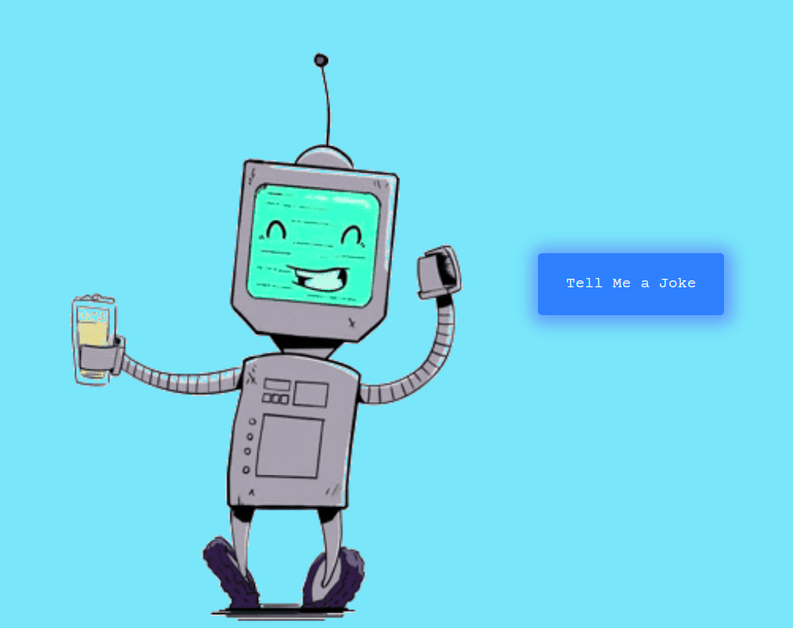

# Robot Joke Teller

---

We call a joke API to get a random joke, we pass that to a 
text to speech API and the robot will tell us that joke.

---

[Link to the Joke API](https://sv443.net/jokeapi/v2/ "The Joke API we used to this project.") 
[Link Text to Speech API](http://www.voicerss.org/api/ "The text to speech API we used to this project.")
